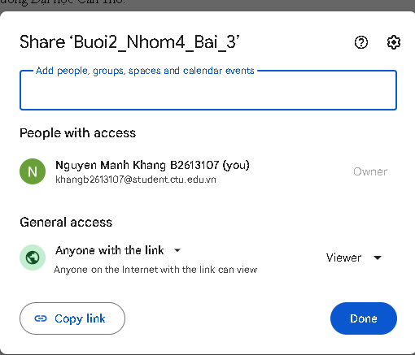
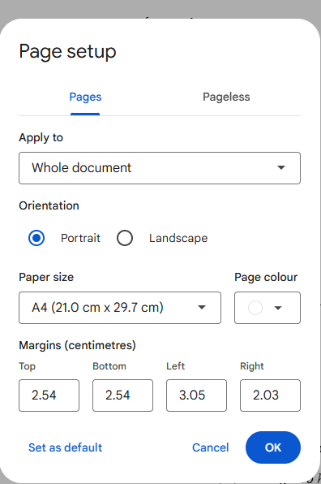
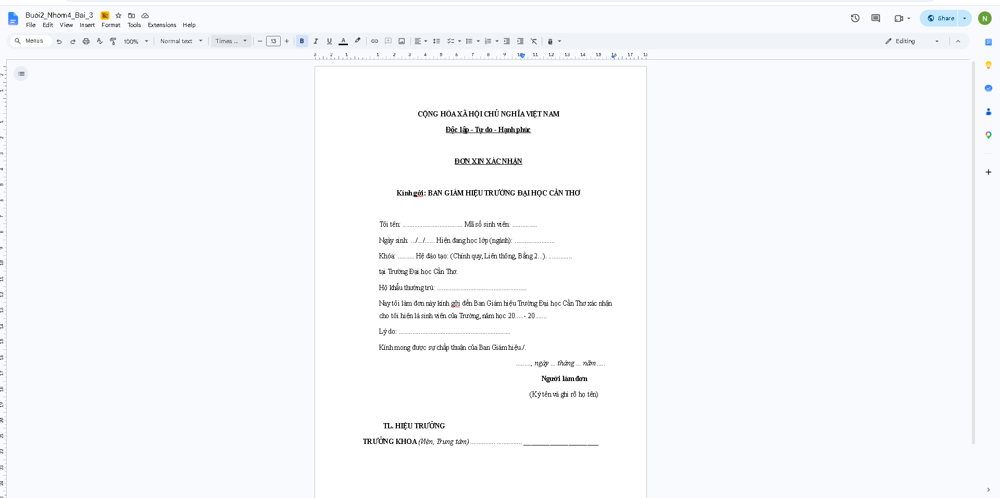
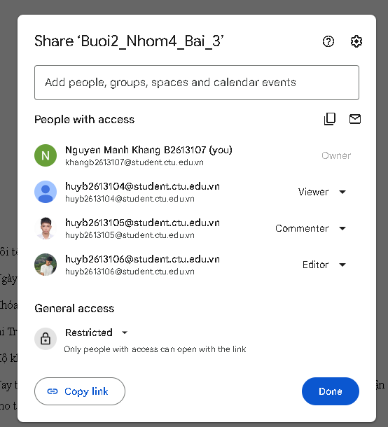
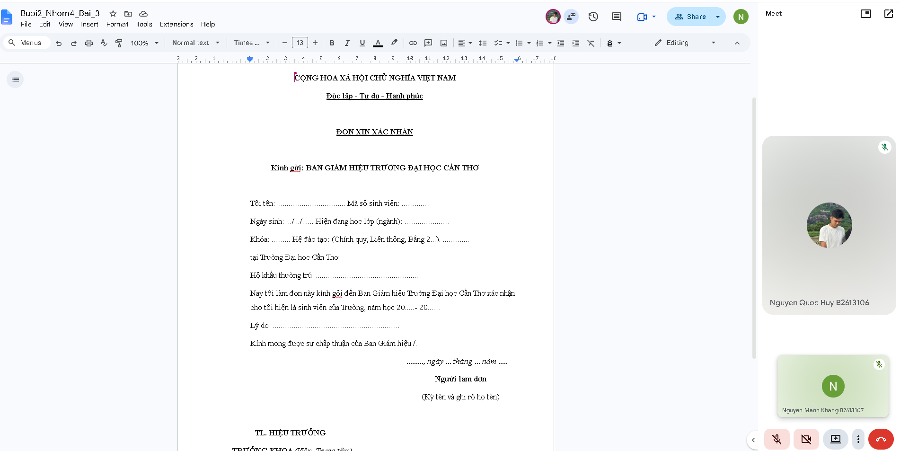
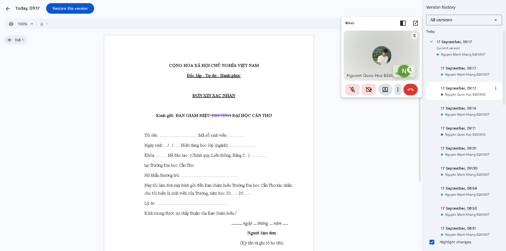

**Link Google Docs:** (dán link vào đây)

---

## 3.1 Tạo file và chia sẻ
Tạo file Buoi2_Nhom4_Bai_3, chia sẻ với tùy chọn "Anyone with the link", quyền Viewer.

## 3.2 Định dạng Page Setup, Font, Paragraph
- Lề: Top 1 inch, Bottom 1 inch, Left 1.2 inch, Right 0.8 inch (2.54 / 2.54 / 3.05 / 2.03 cm)
- Hướng giấy Portrait, khổ A4
- Font Times New Roman, cỡ 13
- Paragraph: Before 6pt, After 6pt, Line spacing 1.5

## 3.3 Tạo và định dạng văn bản
Soạn Đơn xin xác nhận sinh viên theo mẫu.

## 3.4 Chia sẻ quyền, Meeting và History

**Chia sẻ quyền:** đặt General access là Restricted, chia sẻ cho 3 thành viên với quyền Editor, Viewer và Commenter.

**Meeting:** dùng Google Meet trong Google Docs để thảo luận sửa nội dung "Ban Giám hiệu Trường Đại học Cần Thơ" thành "Ban Giám hiệu Đại học Cần Thơ". Thành viên có quyền Editor (B2613106) thực hiện chỉnh sửa.

**History:** xem lại các chỉnh sửa trong Version history, có hiển thị tên người sửa.

